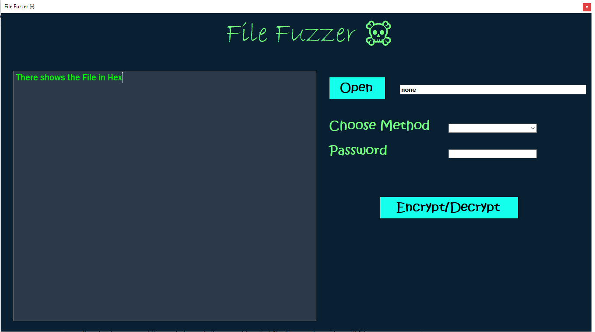

<h1 align="center"> FileEncryptor_CSharp </h1>

<h2>Description </h2>
<h4>
This WindowsForm Application is written in C#.  everybody has things to hidden or encrypt it  and keep it safe from others ! 
so  here is one of the simplest ways to Keep your files safe !
Also this app shows  files in HEX ! 
 </h4>

 
 <h2 >How to work with it ? </h2>
 
Its very easy to use ! 
 
<h4>1-  By Open Btn , select the file that you want to Encrypt or Decrypt  </h4>
<h4>2- Press  Encrypt/decrypt Button to Encrypt or Decrypt yor file !  </h4>
<h3>Attention !!</h3>
<h4>In this version of the app , you can just encrypt your file in one way !  (BinaryData^80)</h4>
 
